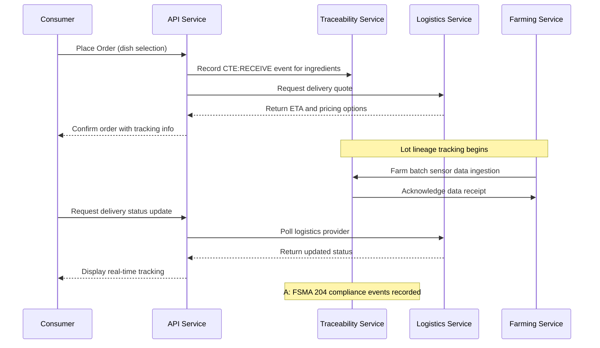
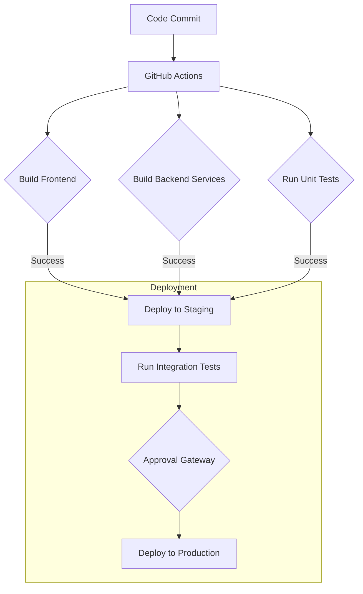

# Seed to Chef Architecture Overview

## System Components

### Frontend Applications
- **Consumer Web**: Next.js 14 application for consumers to browse dishes, place orders, and track deliveries.
- **Consumer Mobile**: React Native Expo app with push notifications.
- **Chef Mobile**: React Native Expo app for chefs to manage tasks, accept orders, and view earnings.
- **Admin Dashboard**: Next.js 14 admin interface for jurisdiction mapping, permit review, and safety monitoring.

### Backend Services
All backend services are built with Python FastAPI and communicate via REST APIs and event-driven messaging (Redpanda/Kafka).

#### Core API Service (`/services/api`)
- **Authentication**: Email+OTP or OAuth placeholder
- **Consumer Endpoints**: Signup/login, dish browsing, search by diet/allergens, order placement, delivery tracking, ratings
- **Chef Endpoints**: Onboarding (ID + video KYC), kitchen connection, permit uploads, skill management, availability declaration, order acceptance/completion
- **Kitchen Management**: HOME/COMMERCIAL kitchen creation, permit uploads, checklist completion, sensor integration stubs
- **Dish Management**: CRUD operations with jurisdiction gating, recipe attachment, HACCP checkpoints
- **Order Processing**: Creation, quoting, payment intent (Stripe Connect), chef assignment via matcher, status updates (evented)
- **Inventory Management**: Lot receipt, decrement on cook, temperature log uploads
- **Traceability**: CTE recording per FSMA 204, lot backtrace endpoints
- **Compliance**: Locality rules engine validation
- **Webhooks**: Stripe, logistics providers, drone provider stub

#### Traceability Service (`/services/traceability`)
- Event consumer (Redpanda/Kafka)
- Key Data Element persistence
- Lot lineage graph generation
- Backtrace endpoints: `/trace/backtrace?order_id=` and `/trace/lot/{lot_code}`

#### Logistics Service (`/services/logistics`)
- **Providers**: PICKUP (no-op), DRIVER (DoorDash Drive/Uber Direct adapters—mocked), DRONE (mission planner mock)
- Route quoting, SLA/ETA estimates
- Dispatch and status polling

#### Recommender Service (`/services/recommender`)
- Demand forecasting (ARIMA/Prophet baseline) → `/forecast/demand`
- Chef matching: skill fit, distance, availability, rating, kitchen compliance, inventory match
- Menu generation from supply + chef skills (LLM-ready stub)

#### Farming Service (`/services/farm`)
- Batch planning from demand forecast (crop, yield, harvest dates)
- Lot creation with GS1-like lot_code convention
- IoT sensor ingest stubs: `/sensors` POST endpoint for air temp, nutrient EC, pH data

## Data Model

### Core Entities

```mermaid
erDiagram
    USER {
        id PK
        email UK
        role ENUM(CONSUMER, CHEF, ADMIN)
        identity_verification JSONB
        rating FLOAT
        location STRING
    }

    KITCHEN {
        id PK
        owner_user_id FK>|--||USER.id
        type ENUM(HOME, COMMERCIAL)
        permits []
        inspections []
        geo STRING
    }

    PERMIT {
        id PK
        kitchen_id FK>|--||KITCHEN.id
        jurisdiction_code STRING
        permit_type STRING
        status STRING
        docs JSONB
    }

    CHEF {
        id PK
        user_id FK>|--||USER.id
        kitchen_id FK>|--||KITCHEN.id
        skills []
        availability JSONB
        training_badges []
    }

    INGREDIENT {
        id PK
        name STRING
        allergens []
        nutrition JSONB
    }

    FARMBATCH {
        id PK
        method ENUM(HYDROPONIC, AEROPONIC, SOIL)
        crop STRING
        planned_yield INT
        planted_at DATETIME
        harvest_at DATETIME
        sensors JSONB
    }

    LOT {
        id PK
        ingredient_id FK>|--||INGREDIENT.id
        farm_batch_id FK>|--||FARMBATCH.id
        lot_code STRING UK
        harvest_date DATE
        FTL_flag BOOLEAN
        trace_meta JSONB
    }
```

### Order Processing Entities

```mermaid
erDiagram
    ORDER {
        id PK
        consumer_id FK>|--||USER.id
        status ENUM(NEW, PROCESSING, COMPLETED, CANCELLED)
        delivery_mode ENUM(PICKUP, DRIVER, DRONE)
        address STRING
        price DECIMAL
        tax DECIMAL
        tip DECIMAL
        assigned_chef_id FK>|--||CHEF.id
    }

    ORDERITEM {
        id PK
        order_id FK>|--||ORDER.id
        dish_id FK>|--||DISH.id
        qty INT
        customizations JSONB
    }

    DISH {
        id PK
        chef_id FK>|--||CHEF.id
        name STRING
        recipe_steps JSONB
        required_ingredients []
        risk_level ENUM(LOW, MEDIUM, HIGH)
        jurisdictions_allowed []
    }
```

### Compliance and Traceability

```mermaid
erDiagram
    COMPLIANCEEVENT {
        id PK
        entity_ref STRING
        cte_type ENUM(RECEIVE, TRANSFORM, SHIP)
        data JSONB
        ts TIMESTAMP
    }

    FEATUREFLAG {
        id PK
        key STRING UK
        on BOOLEAN
    }
```

## Technology Stack

### Frontend
- **Framework**: Next.js 14 (App Router), React Native Expo
- **Styling**: Tailwind CSS, Radix UI components
- **State Management**: React Query, Context API
- **Authentication**: Clerk.com or Auth0 integration

### Backend
- **Language**: Python 3.11
- **Framework**: FastAPI with Pydantic validation
- **ORM**: SQLAlchemy 2.x + Alembic for migrations
- **Database**: PostgreSQL 15+
- **Caching**: Redis
- **Messaging**: Redpanda (Kafka-compatible)
- **Object Storage**: MinIO

### DevOps & Infrastructure
- **Containerization**: Docker, Kubernetes with Helm charts
- **CI/CD**: GitHub Actions
- **Monitoring**: Prometheus + Grafana dashboards
- **Tracing**: OpenTelemetry to Jaeger
- **Secrets Management**: AWS Secrets Manager or HashiCorp Vault

## Deployment Architecture

```mermaid
flowchart TD
    subgraph Consumer[Consumer Web/Mobile]
        A[Browse Dishes] -->|API Call| B[Search API]
        C[Place Order] -->|API Call| D[Order API]
        E[Track Delivery] -->|WebSocket| F[Delivery Updates]
    end

    subgraph Chef[Chef Mobile App]
        G[Accept Orders] -->|API Call| H[Order Assignment]
        I[Update Status] -->|Event| J[Status Tracking]
    end

    subgraph Backend[Backend Services]
        direction TB
        K[API Gateway] --> L[Auth Service]
        K --> M[Consumer API]
        K --> N[Chef API]
        K --> O[Order Processing]

        P[Message Queue] --> Q[Traceability Service]
        P --> R[Logistics Service]
        P --> S[Recommender Engine]
    end

    subgraph Infrastructure[Infrastructure]
        direction TB
        T[PostgreSQL] <-- Database --> U[Redis Cache]
        V[MinIO Storage] <-- File Uploads -->
        W[X.509 Certificates] <-- Security -->
    end

    Consumer --> Backend
    Chef --> Backend
    Backend --> Infrastructure
```

## Compliance and Traceability Flow



## Development Workflow

### Local Development

1. **Prerequisites**: Docker, Node.js (v18+), Python 3.11+, pnpm, Poetry
2. **Setup**:
   ```bash
   # Install JavaScript dependencies
   cd /workspace/seed-to-chef
   pnpm install

   # Install Python dependencies for all services
   poetry install --all
   ```
3. **Start Services**:
   ```bash
   docker-compose up -d
   ```

### Testing

1. **Unit Tests**: Run with pytest and Jest
2. **Integration Tests**: Docker-based end-to-end testing
3. **Compliance Validation**: Automated jurisdiction rule testing

## CI/CD Pipeline



## Security Considerations

1. **Authentication**: JWT tokens with short expiration, refresh tokens stored in HttpOnly cookies
2. **Input Validation**: Pydantic models for API validation, parameterized queries
3. **Data Protection**: Encrypted sensitive fields (KYC data), secure file uploads via signed URLs
4. **Compliance**: FSMA 204 Key Data Element tracking, jurisdiction-specific rules enforcement

## Future Enhancements

1. **Drone Delivery**: Integration with Part 135 operators for BVLOS package delivery
2. **Computer Vision**: HACCP checkpoint verification using AI
3. **Dynamic Grow Planning**: Machine learning-based crop yield optimization
4. **Personalization**: Dietary tagging, macro targets, and recommendation engine enhancements

