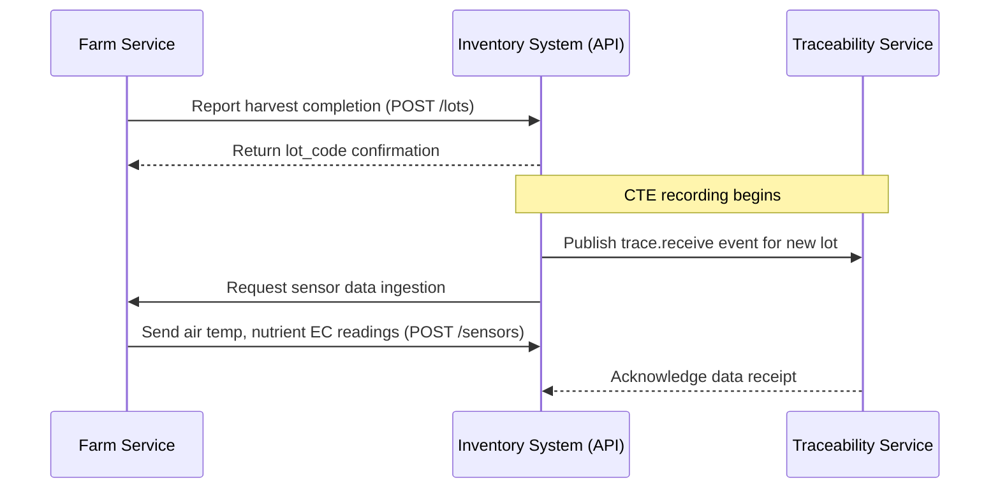

# Seed to Chef Domain Events

## Overview

Seed to Chef uses an event-driven architecture to maintain data consistency across distributed services. This document catalogs all domain events published and consumed within the platform.

## Event Format

All events follow a consistent schema:

```json
{
  "event_id": "uuid4",
  "timestamp": "ISO8601 timestamp",
  "event_type": "string",
  "payload": {
    // event-specific data
  },
  "metadata": {
    "source_service": "string",
    "correlation_id": "optional uuid"
  }
}
```

## Published Events

### Order Events

| Event Type | Description | Publisher Service |
|------------|-------------|-------------------|
| `order.created` | New order placed by consumer | API (`/services/api`) |
| `order.updated` | Order status changed (e.g., accepted, completed) | API |
| `order.cancelled` | Order cancelled by consumer or chef | API |

**Example Payload**:
```json
{
  "event_id": "5a8f1c40-39b6-4e2d-b794-66136a4a0ba2",
  "timestamp": "2025-08-25T14:30:00Z",
  "event_type": "order.created",
  "payload": {
    "order_id": 123,
    "consumer_id": 456,
    "chef_id": 789,
    "status": "NEW",
    "delivery_mode": "DRIVER",
    "total_amount": 29.99
  },
  "metadata": {
    "source_service": "api",
    "correlation_id": "order-123"
  }
}
```

### Inventory Events

| Event Type | Description | Publisher Service |
|------------|-------------|-------------------|
| `inventory.received` | New lot received from farm | API (`/services/api`) |
| `inventory.decremented` | Ingredients used in dish preparation | API |

**Example Payload**:
```json
{
  "event_id": "b2c4f7a0-d1e5-4b83-a9d6-f4e1b2d8c9e1",
  "timestamp": "2025-08-25T10:15:00Z",
  "event_type": "inventory.received",
  "payload": {
    "lot_id": 321,
    "ingredient_id": 678,
    "quantity_received": 5.2,
    "unit": "kg"
  },
  "metadata": {
    "source_service": "api",
    "correlation_id": "inventory-321"
  }
}
```

### Traceability Events

| Event Type | Description | Publisher Service |
|------------|-------------|-------------------|
| `trace.receive` | Ingredients received into inventory (CTE:RECEIVE) | API (`/services/api`) |
| `trace.transform` | Dish prepared from ingredients (CTE:TRANSFORM) | API |
| `trace.ship` | Order delivered to consumer (CTE:SHIP) | Logistics (`/services/logistics`) |

**Example Payload**:
```json
{
  "event_id": "d8e2f3a0-1b9c-4d5e-a6f7-b8c9d2e1f3a4",
  "timestamp": "2025-08-25T12:45:00Z",
  "event_type": "trace.transform",
  "payload": {
    "lot_code": "LT20250825-001-ABCD",
    "dish_id": 987,
    "input_lots": ["LT20250824-003-XYZ", "LT20250824-006-RST"],
    "quantity_processed": 2.1
  },
  "metadata": {
    "source_service": "api",
    "correlation_id": "dish-987"
  }
}
```

### Farm Events

| Event Type | Description | Publisher Service |
|------------|-------------|-------------------|
| `farm.batch.created` | New farm batch planned | Farming (`/services/farm`) |
| `farm.sensor.data` | Sensor reading from farm equipment | Farming |

**Example Payload**:
```json
{
  "event_id": "e4f5g6h0-2i3j-4k5l-6m7n-8o9p1q2r3s4t",
  "timestamp": "2025-08-25T08:00:00Z",
  "event_type": "farm.sensor.data",
  "payload": {
    "batch_id": 101,
    "sensor_type": "air_temperature",
    "value": 72.3,
    "unit": "F",
    "timestamp": "2025-08-25T08:00:00Z"
  },
  "metadata": {
    "source_service": "farm",
    "correlation_id": "batch-101-sensor-airtemp"
  }
}
```

### Logistics Events

| Event Type | Description | Publisher Service |
|------------|-------------|-------------------|
| `logistics.dispatch` | Order dispatched to delivery provider | Logistics (`/services/logistics`) |
| `logistics.status.update` | Delivery status updated (e.g., in transit, delivered) | Logistics |

**Example Payload**:
```json
{
  "event_id": "f6g7h8i0-3j4k-5l6m-7n8o-9p1q2r3s4t5u",
  "timestamp": "2025-08-25T15:20:00Z",
  "event_type": "logistics.status.update",
  "payload": {
    "order_id": 123,
    "delivery_provider": "DoorDash Drive",
    "status": "IN_TRANSIT",
    "tracking_url": "https://track.door dash.com/1234567890"
  },
  "metadata": {
    "source_service": "logistics",
    "correlation_id": "order-123-delivery"
  }
}
```

### Compliance Events

| Event Type | Description | Publisher Service |
|------------|-------------|-------------------|
| `compliance.rule.updated` | New jurisdiction rule added/updated | API (`/services/api`) |

**Example Payload**:
```json
{
  "event_id": "v8w9x0y1-2z3a-4b5c-6d7e-8f9g0h1i2j3k",
  "timestamp": "2025-08-25T09:30:00Z",
  "event_type": "compliance.rule.updated",
  "payload": {
    "jurisdiction_code": "CA_SAN_MATEO_MEHKO",
    "rule_id": "delivery_boundary",
    "new_value": {
      "boundary_type": "county",
      "boundary_id": "CA_SAN_MATEO"
    }
  },
  "metadata": {
    "source_service": "api",
    "correlation_id": "compliance-rule-update"
  }
}
```

## Event Consumers

### Traceability Service (`/services/traceability`)

Consumes:
- `trace.receive`
- `trace.transform`
- `trace.ship`

Responsibilities:
1. Persist Key Data Elements (KDEs)
2. Build lot lineage graph
3. Generate backtrace reports for regulators

### Logistics Service (`/services/logistics`)

Consumes:
- `order.created`
- `order.cancelled`

Responsibilities:
1. Initiate delivery dispatching
2. Poll provider status updates
3. Publish logistics events

### Recommender Service (`/services/recommender`)

Consumes:
- `inventory.received`
- `order.completed`

Responsibilities:
1. Update demand forecasts
2. Refresh chef matching scores
3. Generate menu recommendations

## Event Flow Examples

### Order Processing Flow

```mermaid
sequenceDiagram
    participant C as Consumer
    participant A as API Service
    participant T as Traceability
    participant L as Logistics
    participant R as Recommender

    C->>A: Place order (POST /orders)
    A-->>C: Return order confirmation

    Note over A,T,L,R: Event publishing begins
    A->>T: Publish trace.receive for ingredients
    A->>L: Publish order.created event
    A->>R: Publish inventory.decremented event

    L->>A: Poll delivery provider status updates
    L-->>A: Return updated tracking info
```

### Farm-to-Table Traceability Flow



## Event Delivery Guarantees

### Redpanda Configuration

The platform uses Redpanda with the following reliability settings:

- **Acks**: `all` - ensures all replicas acknowledge write before success
- **Retention Policy**: 7 days for compliance events, 30 days for traceability data
- **Partitioning Strategy**:
  - Order events partitioned by order ID
  - Traceability events partitioned by lot_code

### Dead Letter Queues (DLQ)

Failed event processing is handled via DLQs:

```yaml
# Redpanda topic configuration
topics:
  s2c-trace-events:
    partitions: 8
    replication_factor: 3
    retention_ms: 2592000000 # 30 days
    dlq_enabled: true
```

## Monitoring and Alerts

### Key Metrics Tracked

| Metric | Description |
|--------|-------------|
| `event.publish.latency` | Time taken to publish events (ms) |
| `event.consume.lag` | Delay between event publication and processing (sec) |
| `dlq.event.count` | Number of events in dead letter queues |
| `event.processing.errors` | Count of failed event handlers |

### Alerts Configuration

```yaml
alerts:
  - name: "High Event Processing Lag"
    condition: "event.consume.lag > 60 seconds for more than 5 minutes"
    severity: "WARNING"

  - name: "DLQ Backlog Growing"
    condition: "dlq.event.count > 1000 events"
    severity: "CRITICAL"
```

## Development Guidelines

### Adding New Events

1. **Define the event schema** in `/packages/types/events.ts`
2. **Implement serialization/deserialization** in shared libraries
3. **Add to event registry**:
   ```python
   from src.events import register_event_type

   @register_event_type("new.event.type")
   class NewEventSchema(BaseModel):
       field1: str
       field2: int
   ```

4. **Publish the event** when appropriate:
   ```python
   from src.events.publisher import publish_event

   async def handle_order_creation(order_data):
       # ... order processing logic ...
       await publish_event("order.created", {
           "order_id": order.id,
           "consumer_id": order.consumer_id,
           "total_amount": order.total_amount
       })
   ```

5. **Consume the event** in relevant services:
   ```python
   from src.events import EventHandler, subscribe_to_events

   @subscribe_to_events("order.created")
   async def handle_new_order(event: dict):
       # Process new order notification
       pass
   ```

## Testing Strategy

### Unit Tests for Events

```python
def test_event_serialization():
    event = {
        "event_type": "order.created",
        "payload": {"order_id": 123, "status": "NEW"},
        "metadata": {"source_service": "api"}
    }
    serialized = serialize_event(event)
    assert serialized["timestamp"] is not None
    assert serialized["event_id"] != ""

def test_event_deserialization():
    raw_data = '{"event_type":"order.created","payload":{"order_id":123}}'
    event = deserialize_event(raw_data)
    assert event.event_type == "order.created"
```

### Integration Tests

```python
async def test_order_creation_flow():
    # Place an order via API
    response = await client.post("/orders", json=order_payload)

    # Verify events were published
    trace_events = await redpanda.get_messages("s2c-trace-events")
    assert len(trace_events) >= 1

    logistics_events = await redpanda.get_messages("s2c-logistics-events")
    assert any(e["event_type"] == "order.created" for e in logistics_events)
```

## Security Considerations

### Event Authentication

- All event producers sign messages with HMAC-SHA256
- Consumers verify signatures before processing
- Sensitive data (e.g., KYC information) is excluded from events or encrypted

### Access Control

```python
from src.auth import require_service_auth

@require_service_auth(["traceability", "logistics"])
async def consume_order_events(event: dict):
    # Only services with proper credentials can process these events
```

## Future Enhancements

1. **Event Sourcing**: Implement CQRS pattern for state reconstruction from event history
2. **Schema Registry**: Add Confluent Schema Registry support for strict schema validation
3. **Cross-Region Event Delivery**: Configure multi-zone Redpanda clusters for high availability
4. **Event Replay**: Support for historical event replay during service recovery

## Conclusion

The Seed to Chef event-driven architecture ensures reliable communication between services while maintaining a complete audit trail of all business transactions. This foundation supports real-time processing, compliance tracking, and scalable growth as the platform expands.


