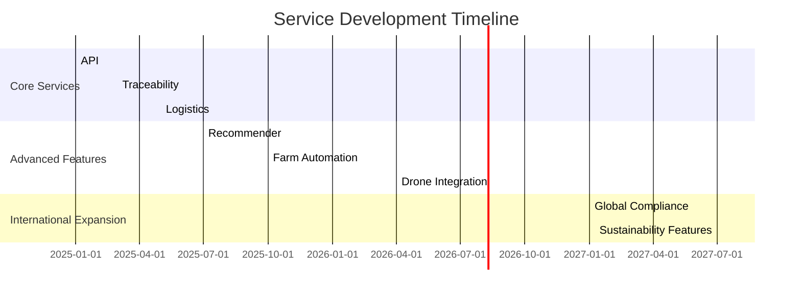
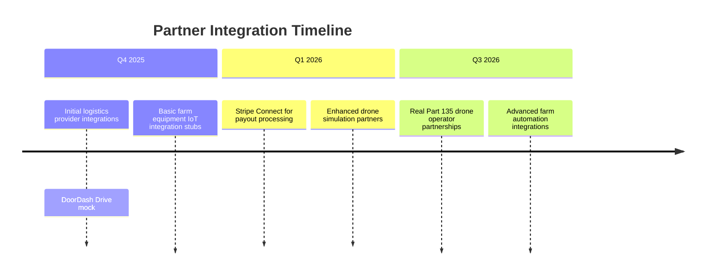

# Seed to Chef Roadmap

## Vision
To build the world's most trusted and efficient vertically-integrated food platform, connecting automated farms with distributed chefs and delivering exceptional meals through innovative logistics solutions.

## Strategic Phases

### Phase 0: Foundational Market Launch (Q4 2025)

**Objective**: Establish proof of concept in two diverse regulatory environments.

**Key Features**:
- **CA San Mateo MEHKO**: Home kitchen hot food delivery with permit validation
- **CO Boulder Cottage Foods**: Non-TCS shelf-stable foods from home kitchens
- **Logistics**: Driver and pickup-only delivery options

**Technical Components**:
1. Core API service implementation (FastAPI)
2. Basic traceability system for FSMA 204 compliance
3. Jurisdiction rules engine with two initial rule sets
4. Mobile apps for consumers and chefs (React Native Expo)
5. Web dashboard for admin operations (Next.js)

**Success Metrics**:
- Successful order completion from MEHKO chef to consumer
- Blocked attempt of TCS food delivery in CO Boulder cottage environment
- Complete lot backtrace functionality working

### Phase 1: National Expansion with Commercial Kitchens (Q2 2026)

**Objective**: Scale to nationwide operations with commercial kitchen support.

**Key Features**:
- **Commercial Kitchen Support**: TCS foods from certified kitchens
- **Expanded Jurisdictions**: Add 5+ new states/counties with varying regulations
- **Advanced Logistics**: Integration with DoorDash Drive/Uber Direct

**Technical Components**:
1. Enhanced compliance rules engine for diverse jurisdictions
2. Commercial kitchen onboarding workflows
3. Advanced inventory management features
4. Chef Academy micro-courses and training badges
5. Stripe Connect integration for payout processing

**Success Metrics**:
- 10+ commercial kitchens onboarded across different states
- Successful TCS food deliveries in multiple jurisdictions
- 95% compliance rule accuracy rate

### Phase 2: Drone Delivery & Computer Vision (Q4 2026)

**Objective**: Introduce cutting-edge delivery methods and automation.

**Key Features**:
- **Drone Delivery**: BVLOS package delivery where legally permitted
- **Computer Vision HACCP**: AI-powered checkpoint verification
- **Dynamic Grow Planning**: Machine learning-based crop optimization

**Technical Components**:
1. Drone mission planning system with provider abstraction layer
2. Computer vision models for food safety inspection
3. ML algorithms for demand forecasting and grow planning
4. Enhanced traceability with blockchain integration options

**Success Metrics**:
- First successful drone delivery in permitted area
- 90% accuracy in computer vision HACCP checks
- 15% improvement in crop yield through dynamic planning

### Phase 3: International Expansion & Sustainability (2027)

**Objective**: Expand globally while minimizing environmental impact.

**Key Features**:
- **Global Jurisdiction Support**: EU FIR, UK food safety regulations
- **Sustainable Packaging**: Eco-friendly materials and reverse logistics
- **Personalization Engine**: Advanced dietary preferences and macro targets

**Technical Components**:
1. International compliance rules engine expansion
2. Sustainable packaging integration with suppliers
3. Reverse logistics credit system for reusable containers
4. Advanced personalization algorithms using LLM integration

**Success Metrics**:
- Successful operations in 3 international markets
- 50% reduction in single-use packaging waste
- 80% customer satisfaction rate with personalized recommendations

## Technical Roadmap

### Infrastructure Evolution

| Phase | Database | Messaging | Storage |
|-------|----------|-----------|---------|
| 0     | PostgreSQL (single instance) | Redpanda (local cluster) | MinIO |
| 1     | PostgreSQL (replicated) | Redpanda (multi-node) | Multi-cloud storage options |
| 2     | Distributed SQL with read replicas | Global message queue | Blockchain for traceability |
| 3     | Multi-region database clusters | Hybrid cloud messaging | Sustainable data centers |

### Service Maturity



### API Evolution

| Version | Release Date | Key Enhancements |
|---------|--------------|------------------|
| v1.0    | Q4 2025      | Core CRUD operations, basic auth |
| v1.1    | Q2 2026      | Advanced filtering, pagination |
| v1.2    | Q4 2026      | GraphQL endpoint support |
| v2.0    | 2027         | Full OpenAPI compliance, async streaming |

## Compliance and Regulatory Roadmap

### FSMA 204 Implementation Phases

```mermaid
flowchart TD
    A[Phase 1: Foundational KDE Tracking] --> B[Phase 2: Enhanced CTE Coverage]
    B --> C[Phase 3: Blockchain Integration]
    C --> D[Phase 4: Global Regulatory Compliance]

    subgraph Phase 1
        E[Basic lot tracking]
        F[CTE:RECEIVE, TRANSFORM, SHIP]
        G[CSV/JSON export capabilities]
    end

    subgraph Phase 2
        H[Expanded KDE coverage]
        I[Real-time compliance validation]
        J[Advanced backtrace visualization]
    end

    subgraph Phase 3
        K[Blockchain audit trail]
        L[Immutable event logging]
        M[Regulator access portal"]
    end

    subgraph Phase 4
        N[EU FIR compliance]
        O[UK food safety regulations]
        P[Global jurisdiction mapping"]
    end
```

### Drone Regulatory Compliance Timeline

| Milestone | Target Date |
|-----------|-------------|
| Part 107 certification for initial drone operations | Q2 2026 |
| BVLOS waiver applications submitted | Q3 2026 |
| First commercial drone delivery (Part 135) | Q4 2026 |
| Remote ID implementation | Q1 2027 |

## Development Milestones

### MVP Completion Criteria

For Phase 0 to be considered successful, the following must be achieved:

1. **Functional End-to-End Flow**:
   - Consumer can browse dishes and place orders
   - Chef can accept orders and update statuses
   - Orders complete successfully with proper payout processing

2. **Compliance Validation**:
   - MEHKO permit validation working for CA San Mateo
   - Cottage food restrictions enforced in CO Boulder
   - Complete lot backtrace available for regulators

3. **Technical Stability**:
   - All services running in Docker Compose environment
   - Basic Kubernetes deployment scripts functional
   - CI/CD pipeline passing all tests

4. **Documentation**:
   - Complete architecture documentation
   - Operations guide with local development instructions
   - API reference documentation generated from OpenAPI specs

### Quality Gates for Each Phase

| Criteria | Phase 0 | Phase 1 | Phase 2 | Phase 3 |
|----------|---------|---------|---------|---------|
| Test Coverage | ≥80% unit tests | ≥90% unit + integration | ≥95% with end-to-end | ≥98% comprehensive |
| Performance | ≤200ms API response time | ≤150ms under load | ≤100ms with caching | Global latency <300ms |
| Uptime SLA | 99.5% availability | 99.7% availability | 99.8% with redundancy | 99.9% multi-region |

## Risk Management

### Top Risks and Mitigation Strategies

| Risk | Mitigation Strategy |
|------|---------------------|
| **Regulatory Non-Compliance** | Proactive engagement with local health departments, regular compliance audits |
| **Technical Debt Accumulation** | Quarterly architecture reviews, refactoring sprints |
| **Market Adoption Challenges** | Pilot programs in selected neighborhoods, chef incentives for early adoption |
| **Supply Chain Disruptions** | Diversified farm partnerships, inventory buffer strategies |

### Contingency Planning

1. **Regulatory Pushback**: Maintain alternative compliance pathways
2. **Technical Failures**: Implement circuit breakers and fallback mechanisms
3. **Market Rejection**: Pivot to B2B food service model if needed

## Partnership Opportunities

### Strategic Alliances

| Partner Type | Potential Partners |
|--------------|--------------------|
| Logistics Providers | DoorDash Drive, Uber Direct, local courier services |
| Drone Operators | Part 135 certified drone companies, BVLOS waiver holders |
| Farm Technology | Vertical farming equipment manufacturers, IoT sensor providers |
| Payment Processors | Stripe Connect, PayPal for Payouts |

### Integration Roadmap



## Conclusion

The Seed to Chef roadmap outlines a strategic path from foundational proof of concept to global food platform leadership. By focusing on regulatory compliance, technological innovation, and operational excellence, we aim to revolutionize the way fresh, safe food is produced and delivered worldwide.

For more detailed planning and updates, please refer to our [project management board](https://github.com/lxsolutions/seed-to-chef/projects) and join our community discussions.


